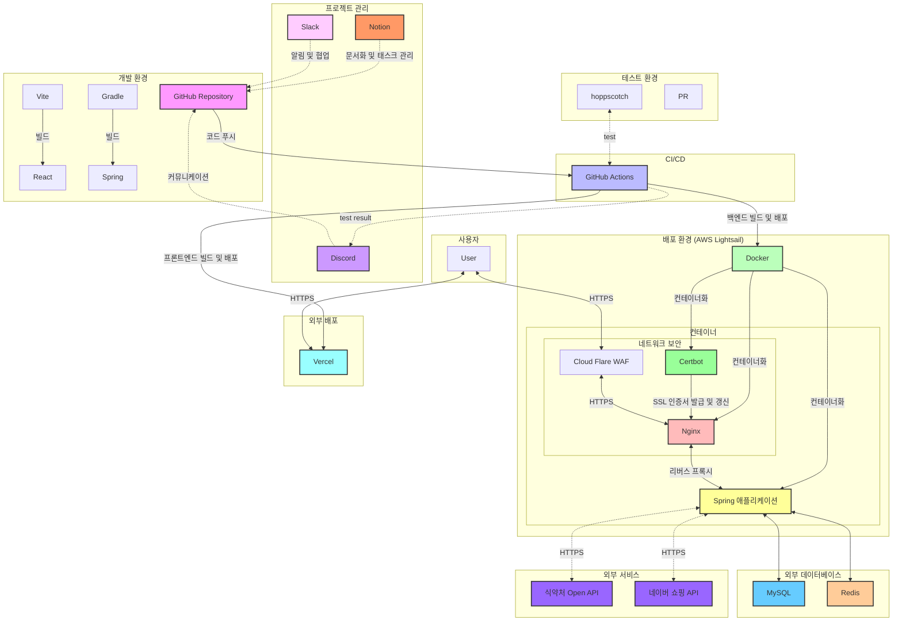

# Aeat 
> 아이도 먹는 알러지/프리프롬 오픈마켓


## 목차
- [🚀 프로젝트 소개](#-프로젝트-소개)
- [👥 팀원 소개](#-팀원-소개)
- [💡 주요 기능](#-주요-기능)
- [🛠 기술 스택](#-기술-스택)
- [📚 ERD & 아키텍처](#-erd--아키텍처)
- [📜 API 명세서](#-api-명세서)
- [🔗 링크 모음](#-링크-모음)


## 🚀 프로젝트 소개

> ### 한눈에 모아보는 알러지/프리프롬 상품 정보
> AEat은 사용자가 안전하고 건강한 알러지, 프리프롬, 환자식 제품을 손쉽게 찾을 수 있도록 돕는 공간입니다. 사용자가 자신이 원하는 알러지 정보를 선택하면 개인화된 알러지 필터링 기능을 통해 자신에게 맞는 제품을 더욱 정확하게 추천받을 수 있습니다. 또한, 소비자는 피해야 할 알러지 성분이나 프리프롬 요구 사항, 환자식 조건을 설정해 관련 상품들만 볼 수 있습니다. AEat은 식약청 기준의 알러지 유발 물질을 표기하여, 구매 전 알러지 반응을 미리 예방할 수 있도록 돕습니다.

## 👥 팀원 소개

| [](https://github.com/jjh4450) | [](https://github.com/youcastle03) | [](https://github.com/peacefullyquietly) |
|:---------------------------------------------------------------------------------------------------------------:|:-------------------------------------------------------------------------------------------------------------:|:-------------------------------------------------------------------------------------------------------------:|
|                                   [강원대 BE 조준환](https://github.com/jjh4450)                                   |                                   [강원대 BE 최유성](https://github.com/youcastle03)                                   |                                   [강원대 BE 박지희](https://github.com/peacefullyquietly)                                    |

| [](https://github.com/humpose) | [](https://github.com/dandamdandam) | [](https://github.com/codus1718) |
|:---------------------------------------------------------------------------------------------------------------:|:-------------------------------------------------------------------------------------------------------------:|:-------------------------------------------------------------------------------------------------------------:|
|                                   [강원대 BE 오승환](https://github.com/humpose)                                   |                                   [강원대 FE 정다연](https://github.com/dandamdandam)                                   |                                   [강원대 FE 이채연](https://github.com/codus1718)                                    |

## 💡 주요 기능

🔐 ***로그인/로그아웃***
 
  
 
✍🏻 ***상품 리뷰***
  - 사용자가 원하는 제품에 대한 종합적인 리뷰 가능
  - 상품 리뷰 기능을 통해 다른 사용자의 후기를 참고하여 보다 현명한 소비 결정을 내릴 수 있습니다

♥ ***상품 위시리스트***
  - *상품 내 찜하기 기능을 통해 사용자가 원하는 제품들을 표시해두고 모아서 보여주는 기능*
  - 사용자는 자신이 관심있는 상품들을 찜하여 모을 수 있어, 나중에 쉽게 찾아볼 수 있습니다
  - 이를 통해 자신에게 필요한 알러지 정보나 프리프롬 식품을 가진 제품을 편리하게 추적하고 관리할 수 있습니다

 ⛓️ ***연관 상품 조회***
  - 가격, 알러지, 프리프롬을 기준으로 상품을 모아서 보여주는 기능
  - 특정 알러지를 피하는 제품들을 빠르게 찾아볼 수 있어, ***사용자 맞춤형*** 쇼핑이 가능합니다

📰 ***알러지 관련 컬럼 제공***
  - 알러지와 관련된 컬럼을 다루는 페이지를 통해 사용자들에게 유용한 정보를 제공하고 있습니다

⚠ ***전 상품 알러지 유발 물질 표기***
  - 모든 상품들에 대해 식약청 기준의 알러지 유발 물질을 정확히 표기하여 제공하고 있습니다

🏷️ ***프리프롬 식품 및 환자식 태그 제공**
  - 프리프롬 식품과 환자식(당뇨 환자, 신진대사질환자)에 대한 태그 기능을 제공합니다
  - 글루텐 프리, 유당 불내증(락토 프리), 나트륨 프리(무염식) 등의 태그로 조건에 맞는 제품을 쉽게 찾을 수 있습니다

🔎 ***구매 사이트 이동***
  - 각 상품에 대해 구매할 수 있는 URL을 제공하여, 사용자가 원하는 판매 사이트로 바로 이동하여 구매할 수 있습니다.
  - 제품을 찾는 것뿐만 아니라 직접 구매까지 이어지는 쇼핑 경험을 제공합니다

## 🛠 기술 스택

- ### 프론트엔드
  
  
  
  
- ### 백엔드
  
- ### 데이터베이스
  
  
- ### 인프라
  
- ### CI/CD
  
  


## 📚 ERD & 아키텍처

- ***ERD***
  

  [AEat_ERD.pdf](https://github.com/user-attachments/files/17770711/AEat_ERD.pdf)

- ***Directory Structure***
  ```
  src
    ├── main
    │   ├── java
    │   │   └── jeje
    │   │       └── work
    │   │           └── aeatbe
    │   │               ├── annotation
    │   │               ├── config
    │   │               ├── controller
    │   │               ├── domian
    │   │               ├── dto
    │   │               │   ├── Kakao
    │   │               │   ├── allergyCategory
    │   │               │   ├── article
    │   │               │   ├── articleLike
    │   │               │   ├── freeFromCategory
    │   │               │   ├── ocr
    │   │               │   ├── product
    │   │               │   ├── review
    │   │               │   ├── user
    │   │               │   └── wishlist
    │   │               ├── entity
    │   │               ├── exception
    │   │               ├── interceptor
    │   │               ├── mapper
    │   │               │   ├── Review
    │   │               │   ├── allergyCategory
    │   │               │   ├── article
    │   │               │   ├── freeFromCategory
    │   │               │   └── product
    │   │               ├── repository
    │   │               ├── resolver
    │   │               ├── service
    │   │               └── utility
    │   └── resources
    └── test
        ├── java
        │   └── jeje
        │       └── work
        │           └── aeatbe
        │               ├── entity
        │               ├── mapper
        │               │   ├── allergyCategory
        │               │   ├── freeFromCategory
        │               │   └── product
        │               └── service
        └── resources 


- **서비스 아키텍처**: 주요 서비스 간 연결과 흐름 설명

    

## 📜 API 명세서

- [API Docs](https://quickest-asterisk-75d.notion.site/Ben-Potato-7ccefe723eca4df6a015e6cbf139fd0c?p=bae119239d30411285fdbfe7756518a0&pm=s)

## 🔗 링크 모음

- **프로젝트 사이트**: [https://aeat.jeje.work](https://aeat.jeje.work)
- **노션 문서**: [노션 링크](https://quickest-asterisk-75d.notion.site/Ben-Potato-7ccefe723eca4df6a015e6cbf139fd0c)
- ### 🖥️배포 링크

  **프로젝트 사이트**: [https://aeat.jeje.work](https://aeat.jeje.work)

- ### 📜커밋 컨벤션

  [Commit Convention](https://quickest-asterisk-75d.notion.site/Ben-Potato-7ccefe723eca4df6a015e6cbf139fd0c?p=a836423c43b94ae8833111fcd0ddeb7e&pm=s)

- ### 👨‍💻코딩 컨벤션

  [Coding Convention](https://quickest-asterisk-75d.notion.site/Ben-Potato-7ccefe723eca4df6a015e6cbf139fd0c?p=9076a9f32a3a4fb0a20e0c41045c9e6f&pm=s)

- ### 🤝그라운드 룰

  [Ground Rule](https://quickest-asterisk-75d.notion.site/Ben-Potato-7ccefe723eca4df6a015e6cbf139fd0c?p=970ccd298d744198bc44924ebedb7d6d&pm=s)

- ### 🏁피드백
  - 4주차 코드 리뷰 : https://github.com/kakao-tech-campus-2nd-step3/Team2_BE/pull/3
  - 5주차 코드 리뷰 : https://github.com/kakao-tech-campus-2nd-step3/Team2_BE/pull/15
  - 6주차 코드 리뷰 : https://github.com/kakao-tech-campus-2nd-step3/Team2_BE/pull/37
  - 7주차 코드 리뷰 : https://github.com/kakao-tech-campus-2nd-step3/Team2_BE/pull/47
  - 9주차 코드 리뷰 : https://github.com/kakao-tech-campus-2nd-step3/Team2_BE/pull/69
  - 10주차 코드 리뷰 : https://github.com/kakao-tech-campus-2nd-step3/Team2_BE/pull/97
